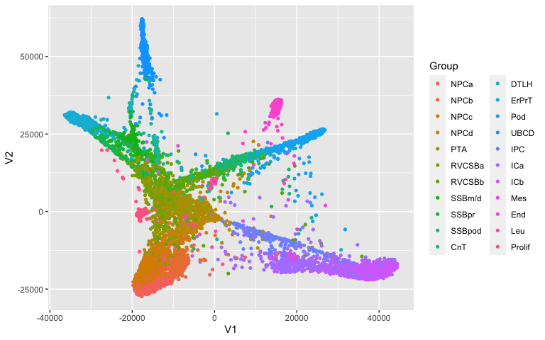
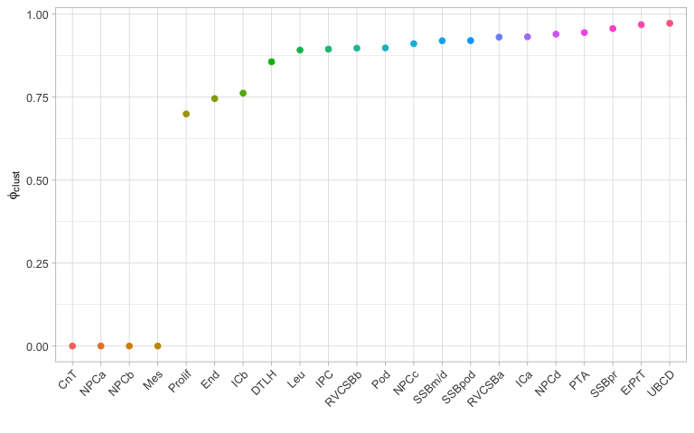
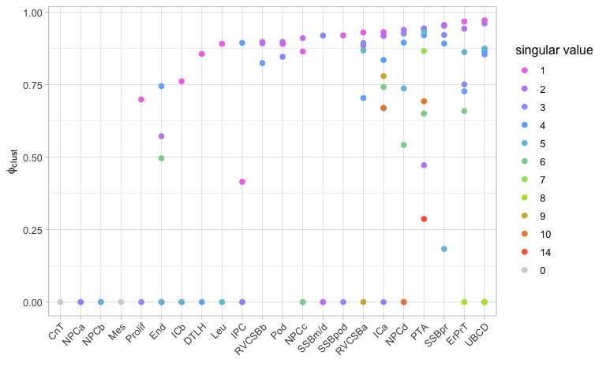
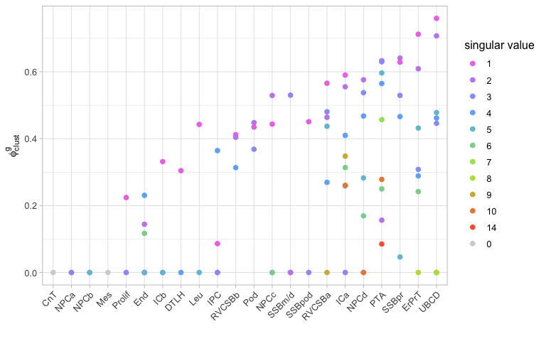
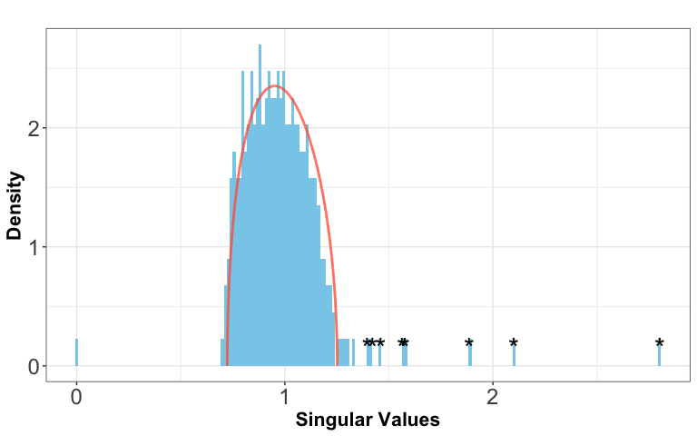
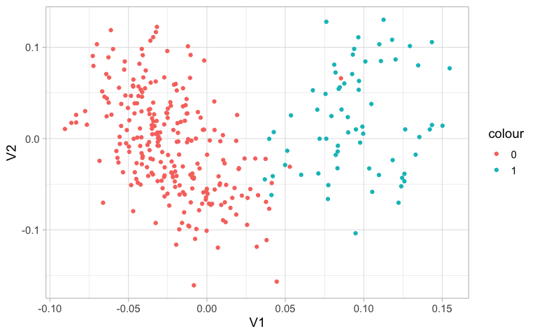

``` r
library(SIGMA)
library(ggplot2)
library(Seurat)
```

The authors who have anlyzed this data already normalized the data set
with the R package “scran” and determined clusters by hierachical
clustering. In total they have found 22 clusters.

``` r
data("force_gr_kidney")
data("sce_kidney")

paga.coord$Group <- sce_kidney$cell.type

ggplot(paga.coord, aes(x = V1, y = V2, colour = Group)) +
  geom_point(shape = 16)
```


With SIGMA, we are now able to assess the variability for each cluster
and see if possible sub-clusters can be found. First, we load the
preprocessed SingleCellObject of the kidney data.

``` r
#Load kidney data from package

#Extract scran normalized counts and log-transform
expr.norm.log <- as.matrix(log(assay(sce_kidney, "scran")+1))

#Change the name of the rows to readable gene names
rownames(expr.norm.log) <- as.character(rowData(sce_kidney)$HUGO)
rownames(sce_kidney) <- as.character(rowData(sce_kidney)$HUGO)
```

In the next step we would like to exclude certain variances from
appearing in the measure. For example, in this fetal kidney data set,
several factors would not be of interest to cluster on: cell cycle
related variances, ribosomal and mitochondrial gene expression. As, well
as stress related genes, which arise during dissociation. Cycling genes,
we determine here with the Seurat package, so for that we first need to
create a Seurat object and normalize it. Another important factor is
technical variability, for example the varying number of transcripts.
It’s important to also include that in the data frame.

``` r
#Creating Seurat object
cnts <- counts(sce_kidney)
colnames(cnts) <- 1:ncol(cnts)
rownames(cnts) <- as.character(rowData(sce_kidney)$HUGO)

fetalkidney <- CreateSeuratObject(cnts)
#> Warning: Non-unique features (rownames) present in the input matrix, making unique
#> Warning: Feature names cannot have underscores ('_'), replacing with dashes ('-')
fetalkidney <- NormalizeData(fetalkidney)

#Cell cycle analysis
s.genes <- cc.genes$s.genes
g2m.genes <- cc.genes$g2m.genes

fetalkidney <- CellCycleScoring(fetalkidney, s.features = s.genes, g2m.features = g2m.genes, set.ident = TRUE)
#> Warning: The following features are not present in the object: MLF1IP, not searching for symbol synonyms

#Determining the expression of MT-genes, Rb-genes and stress genes:
data("ribosomal_genes")
data("stress_genes")

rb <- rownames(fetalkidney) %in% rb.genes 
stress.genes <- intersect(stress.genes, rownames(expr.norm.log))

#Creating the final data frame with all the factors to be excluded from considering while calculating the clusterability measure:
exclude <- data.frame(clsm = log(colSums(cnts) + 1), cellcycle = fetalkidney$G2M.Score, 
                      mt = colMeans(expr.norm.log[grep("^MT-", rownames(expr.norm.log)),]), 
                      ribosomal = colMeans(expr.norm.log[rb,]), stress = colMeans(expr.norm.log[stress.genes,]))
```

Now we are ready to apply the main function to determine clusterability:

``` r
#Main funcion SIGMA
out_kidney <- sigma_funct(expr.norm.log, clusters = sce_kidney$cell.type, exclude = exclude)
#> Calculating values for cluster  NPCc 
#> Dim:  9300 596 
#> Calculating svd ... 
#> Scaled by:  0.9936921 
#> Market Mode:  596 
#> Calculating values for cluster  DTLH 
#> Dim:  2561 67 
#> Calculating svd ... 
#> Scaled by:  0.9549873 
#> Market Mode:  67 
#> Calculating values for cluster  ICa 
#> Dim:  9703 653 
#> Calculating svd ... 
#> Scaled by:  0.9941114 
#> Market Mode:  653 
#> Calculating values for cluster  CnT 
#> Dim:  2116 80 
#> Calculating svd ... 
#> Scaled by:  0.971555 
#> Market Mode:  80 
#> Calculating values for cluster  UBCD 
#> Dim:  4435 317 
#> Calculating svd ... 
#> Scaled by:  0.9752237 
#> Market Mode:  317 
#> Calculating values for cluster  ErPrT 
#> Dim:  5580 338 
#> Calculating svd ... 
#> Scaled by:  0.9872483 
#> Market Mode:  338 
#> Calculating values for cluster  RVCSBa 
#> Dim:  6180 367 
#> Calculating svd ... 
#> Scaled by:  0.9881706 
#> Market Mode:  367 
#> Calculating values for cluster  ICb 
#> Dim:  10031 677 
#> Calculating svd ... 
#> Scaled by:  0.9956775 
#> Market Mode:  677 
#> Calculating values for cluster  SSBpr 
#> Dim:  3862 213 
#> Calculating svd ... 
#> Scaled by:  0.9705424 
#> Market Mode:  213 
#> Calculating values for cluster  NPCd 
#> Dim:  5201 280 
#> Calculating svd ... 
#> Scaled by:  0.9815733 
#> Market Mode:  280 
#> Calculating values for cluster  SSBpod 
#> Dim:  7331 257 
#> Calculating svd ... 
#> Scaled by:  0.9920918 
#> Market Mode:  257 
#> Calculating values for cluster  IPC 
#> Dim:  6395 177 
#> Calculating svd ... 
#> Scaled by:  0.98267 
#> Market Mode:  177 
#> Calculating values for cluster  Pod 
#> Dim:  9328 430 
#> Calculating svd ... 
#> Scaled by:  0.9889339 
#> Market Mode:  430 
#> Calculating values for cluster  PTA 
#> Dim:  6682 459 
#> Calculating svd ... 
#> Scaled by:  0.9861411 
#> Market Mode:  459 
#> Calculating values for cluster  NPCa 
#> Dim:  9150 522 
#> Calculating svd ... 
#> Scaled by:  0.9945157 
#> Market Mode:  522 
#> Calculating values for cluster  RVCSBb 
#> Dim:  8449 312 
#> Calculating svd ... 
#> Scaled by:  0.9893211 
#> Market Mode:  312 
#> Calculating values for cluster  End 
#> Dim:  7027 223 
#> Calculating svd ... 
#> Scaled by:  0.9868303 
#> Market Mode:  223 
#> Calculating values for cluster  SSBm/d 
#> Dim:  2647 151 
#> Calculating svd ... 
#> Scaled by:  0.977434 
#> Market Mode:  151 
#> Calculating values for cluster  NPCb 
#> Dim:  6334 296 
#> Calculating svd ... 
#> Scaled by:  0.9918222 
#> Market Mode:  296 
#> Calculating values for cluster  Leu 
#> Dim:  1352 65 
#> Calculating svd ... 
#> Scaled by:  0.9256314 
#> Market Mode:  65 
#> Calculating values for cluster  Mes 
#> Dim:  1133 37 
#> Calculating svd ... 
#> Scaled by:  0.9470118 
#> Market Mode:  37 
#> Calculating values for cluster  Prolif 
#> Dim:  2132 85 
#> Calculating svd ... 
#> Scaled by:  0.9699548 
#> Market Mode:  85
```

We can have a look at the main output of this function. For each
cluster, the corresponding clusterability measure is shown.

``` r
#Evaluate the output of the measure

#plot all values for sigma
plot_sigma(out_kidney)
```



If you would like to go into more detail, then you can have a look at
all sigmas and g-sigmas that are available per cluster.

``` r
#Plot all values for sigma and g_sigma
plot_all_sigmas(out_kidney)
```



``` r
plot_all_g_sigmas(out_kidney)
```



If you are interested in the values of all sigmas, g-sigmas and singular
values of the signal matrix, then this information can be obtained with
the help of this function.

``` r
#obtain the values for sigma and additional information
get_info(out_kidney, "UBCD")
#>        sigma   g_sigma     theta    r2vals singular_value celltype
#> 16 0.9718702 0.7595932 1.8030720 0.4468447              1     UBCD
#> 17 0.9613534 0.7073134 1.5854881 0.1810414              2     UBCD
#> 18 0.8545601 0.4459294 0.9704636 0.4134855              3     UBCD
#> 19 0.8649745 0.4617228 0.9958318 0.1402408              4     UBCD
#> 20 0.8749372 0.4779268 1.0228843 0.1069279              5     UBCD
#> 21 0.0000000 0.0000000 0.5170606 0.4340084              6     UBCD
#> 22 0.0000000 0.0000000 0.5170606 0.2978763              7     UBCD
#> 23 0.0000000 0.0000000 0.5170606 0.2157584              8     UBCD
```

Now, to determine if the clustrs with a high clusterability measure have
variances that are meaningful for you to sub-cluster, have a look at the
variance driving genes, which will tell you which genes cause the signal
to appear. For example, if genes are only related to differentiation,
then sub-clustering might not be necessary but could be of interest.

``` r
#See which genes cause variances in the data
get_var_genes(out_kidney, "UBCD")[,1:3]
#>            Singular.vector.1 Singular.vector.2 Singular.vector.3
#> Highest-1               RPS6              HES1               CLU
#> Highest-2              DHRS2               FOS              CTSH
#> Highest-3             SPINK1               ID2             MGST3
#> Highest-4             S100A6               ID1             EPCAM
#> Highest-5               HPGD               JUN             CYB5A
#> Highest-6              VSIG2             DDIT4             GSTM3
#> Highest-7               KRT7              JUNB               CD9
#> Highest-8              FXYD3             DUSP1             GSTP1
#> Highest-9              FBLN1           GADD45B              CD24
#> Highest-10             S100P          HSP90AB1            TUBA4A
#> Highest-11           S100A11             ADIRF              DDX5
#> Highest-12             ADIRF             RGS16              SKP1
#> Highest-13              SNCG              IER2              AGR2
#> Highest-14             PVALB             FABP5           S100A11
#> Highest-15             UPK1A               ID3              MYL6
#> Highest-16             UQCRQ             TXNIP          HSP90AB1
#> Highest-17             RPS18             H3F3A              ENO1
#> Highest-18            HMGCS2               UBB            TSPAN1
#> Highest-19              FTH1            HSPA1A             ITM2B
#> Highest-20              PSCA              RBP1            MYL12B
#> Highest-21             ADH1C              GPC3              ARG2
#> Highest-22             RPL34              IGF2             CALM2
#> Highest-23            LGALS3             SPARC              KRT8
#> Highest-24             RPL31          HSP90AA1            MYL12A
#> Highest-25           SHROOM1              TPM2             H3F3B
#> Highest-26             LEAP2              SNCG             SYPL1
#> Highest-27              UPK2           TSC22D1          LGALS3BP
#> Highest-28             CISD3            HSPA1B             KRT19
#> Highest-29             RPLP1            LGALS1             GAPDH
#> Highest-30            MT-ND3              SMC2             CLIC1
#> Highest-31             RPL12         HNRNPA2B1              RGS2
#> Highest-32              IGF2             MYLIP            MALAT1
#> Highest-33            S100A4             CALD1              CAPG
#> Highest-34              PERP             HMGB2         LINC00675
#> Highest-35            MT-ND4             NR2F1              AOC1
#> Highest-36             FABP5            YME1L1             GATA2
#> Highest-37              FBP1            COL1A2            SCPEP1
#> Highest-38             GDF15             NR2F2          TMEM176B
#> Highest-39             RPL26             SEPT7             ACTG1
#> Highest-40           MT-ATP6              IDH1             HSPA5
#> Highest-41           C9orf16           TMSB15A             DEGS2
#> Highest-42             RPS14            ZNF503               UBC
#> Highest-43             RPL41            DNAJA1             CLDN7
#> Highest-44             FAM3B             DDIT3              CAPS
#> Lowest-1              TMSB4X            PHLDA2              RPS2
#> Lowest-2             NGFRAP1              AQP2            COL1A2
#> Lowest-3                ACTB         TNFRSF12A            COL3A1
#> Lowest-4              IGFBP7             KRT18            COL1A1
#> Lowest-5               WFDC2            ERRFI1            RPL13A
#> Lowest-6               CLDN3             RPL41             RPL13
#> Lowest-7              NDUFA4              HES4               PTN
#> Lowest-8                MEST              SAT1             RPL28
#> Lowest-9               HINT1               CLU              RPS3
#> Lowest-10              STMN1            SDF2L1             RPS12
#> Lowest-11               PTMA              TPM4            LGALS1
#> Lowest-12              ACTG1             CLDN4              GPC3
#> Lowest-13               BCAM              RPL3              ZEB2
#> Lowest-14                VIM            TMSB4X             RPLP1
#> Lowest-15               STC1            PHLDA1            RPL18A
#> Lowest-16               NREP            ZFAND5              CTSC
#> Lowest-17              CYR61            MAP2K3             RPS20
#> Lowest-18             PTGER1              GUK1             RPS16
#> Lowest-19            HNRNPA1               FTL             RPS19
#> Lowest-20              HMGN1              CREM            RPL10A
#> Lowest-21                MAL             COTL1             RPL15
#> Lowest-22                MDK           LRRFIP1             RPS17
#> Lowest-23             SBSPON              MAL2             SPARC
#> Lowest-24               TPM4             EPHA2             RPS18
#> Lowest-25              HMGB1          TMEM176A               VIM
#> Lowest-26              SUMO2             FOSL1             CALD1
#> Lowest-27              EPCAM            CYSTM1            CNKSR3
#> Lowest-28              MYH10         LINC00152            RPS15A
#> Lowest-29            S100A13           GADD45A             SOCS3
#> Lowest-30             CNKSR3            ZNF430             RPL18
#> Lowest-31               HES4              ODC1             RPL32
#> Lowest-32          TNFRSF12A       MIR4435-2HG             NR2F1
#> Lowest-33             TUBB2B              CD24            RPL37A
#> Lowest-34               MEG3           S100A10             TCF21
#> Lowest-35            C6orf48           CDK2AP2             RPS14
#> Lowest-36              SNRPN             WFDC2              RPS8
#> Lowest-37               TUBB             RPLP0             RPL10
#> Lowest-38             TUBA1B            PTP4A1            EEF1B2
#> Lowest-39             NAP1L1               HN1               TNC
#> Lowest-40              BCAT1              KRT8             MFAP4
#> Lowest-41            COL18A1               TES             RPL19
#> Lowest-42              EFNB2              KTN1              RPL9
#> Lowest-43              HMGN2              MAFF             RPL30
#> Lowest-44               JUND             SERP1              TPT1
```

You can also check out the fit of the MP distribution for each cluster.

``` r
#Check if the MP distribution fits to the data
plot_MP(out_kidney, "UBCD")
```



And for fruther validation, see if the singular vectors of the
significant singular values look meaningful. By plotting either clusters
or genes with the singular vectors.

``` r
#Plot clusters
plot_singular_vectors(out_kidney, "UBCD", colour = sce_kidney@metadata$ubcd.cluster)
```



``` r

#Plot variance driving genes
plot_singular_vectors(out_kidney, "UBCD", colour = "UPK1A", scaled = FALSE)
```


