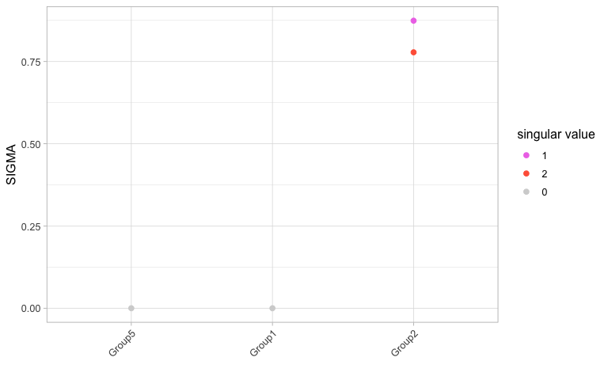

First you need to load the package and ggplot2 for the plots. We use
splatter here to construct a toy data set.

``` r
library(SIGMA)
library(splatter)
library(ggplot2)
```

Here, we import splatter data from the package, called “splatO”. And
undergo the necessary processings steps for the measure.

``` r
#Load sample data simulated with splatter
data("splatO")

expr <- counts(splatO)
expr <- expr[rowSums(expr)>0,]

#Normalize and log-transform the data
expr.norm <- t(t(expr)/colSums(expr))*10000
expr.norm.log <- log(expr.norm + 1)

#Create toy example of a data set
test.cluster <- as.character(splatO$Group)
test.cluster[test.cluster == "Group3"] <- "Group2"
test.cluster[test.cluster == "Group4"] <- "Group2"
```

Then, we are ready to run the main function for clusterability:

``` r
#Main funcion that calculates the clusterability
out <- sigma_funct(expr = expr.norm.log, clusters = test.cluster, 
                   exclude = data.frame(clsm = log(colSums(expr) + 1)))
#> Calculating values for cluster  Group5 
#> Dim:  750 148 
#> Calculating svd ... 
#> Scaled by:  0.986122 
#> Calculating values for cluster  Group2 
#> Dim:  776 308 
#> Calculating svd ... 
#> Scaled by:  0.9832622 
#> Market Mode:  308 
#> Calculating values for cluster  Group1 
#> Dim:  685 44 
#> Calculating svd ... 
#> Scaled by:  0.9624504 
#> Market Mode:  44
```

We can have a look at the main output of this function. For each
cluster, the corresponding clusterability measure is shown.

``` r
#Evaluate the output of the measure

#plot all values for sigma
plot_sigma(out)
```


If you would like to go into more detail, then you can have a look at
all sigmas and g-sigmas that are available per cluster.

``` r
#Plot all values for sigma and g_sigma
plot_all_sigmas(out)
```



``` r
plot_all_g_sigmas(out)
```


If you are interested in the values of all sigmas, g-sigmas and singular
values of the signal matrix, then this information can be obtained with
the help of this function.

``` r
#obtain the values for sigma and additional information
get_info(out, "Group2")
#>       sigma   g_sigma    theta       r2vals singular_value celltype
#> 2 0.8741445 0.7601921 1.904313  0.004357550              1   Group2
#> 3 0.7780456 0.6315494 1.484265 -0.002419244              2   Group2
```

Now, to determine if the clustrs with a high clusterability measure have
variances that are meaningful for you to sub-cluster, have a look at the
variance driving genes, which will tell you which genes cause the signal
to appear. For example, if genes are only related to differentiation,
then sub-clustering might not be necessary but could be of interest.

``` r
#See which genes cause variances in the data
get_var_genes(out, "Group2")
#>           Singular.vector.1 Singular.vector.2
#> Highest-1           Gene401           Gene967
#> Highest-2           Gene800           Gene996
#> Highest-3           Gene806           Gene637
#> Highest-4           Gene762           Gene622
#> Highest-5           Gene386           Gene446
#> Highest-6           Gene387           Gene203
#> Highest-7           Gene905           Gene754
#> Highest-8           Gene428           Gene325
#> Lowest-1            Gene865           Gene775
#> Lowest-2            Gene714           Gene728
#> Lowest-3             Gene65           Gene330
#> Lowest-4            Gene446           Gene116
#> Lowest-5            Gene785           Gene154
#> Lowest-6            Gene603           Gene785
#> Lowest-7            Gene203           Gene960
#> Lowest-8            Gene771             Gene2
```

You can also check out the fit of the MP distribution for each cluster.

``` r
#Check if the MP distribution fits to the data
plot_MP(out, "Group2")
```


And for further validation, see if the singular vectors of the
significant singular values look meaningful. By plotting either clusters
or genes with the singular vectors.

``` r
#Plot clusters
plot_singular_vectors(out, "Group2", colour = splatO$Group[test.cluster == "Group2"])
```


``` r

#Plot variance driving genes
plot_singular_vectors(out, "Group2", colour = "Gene401")
```


